# User Manual

## Logging into the System

### Overview

Logging into the Snackbase App requires user credentials provided by the system administrator. In case of forgotten passwords, the administrator is responsible for resetting the password.

### Steps to Log In

1. **Navigate to the Login Page**

    - Open your web browser and go to application page.
    - You will see a login form titled **Zaloguj się** (Log in).

2. **Enter Your Credentials**

    - **Email** – Enter your registered email address.
    - **Password** – Enter the password assigned by the system administrator.

3. **Submit the Form**

    - Click the **Zaloguj** (Log in) button.

4. **Successful Login**

    - Upon successful login, you will be redirected to the main dashboard.
    - The dashboard will display a welcome message such as:
      > "Witaj [Your Name]! Wybierz opcję z paska nawigacji aby rozpocząć"\
      > (Welcome [Your Name]! Select an option from the navigation bar to start.)

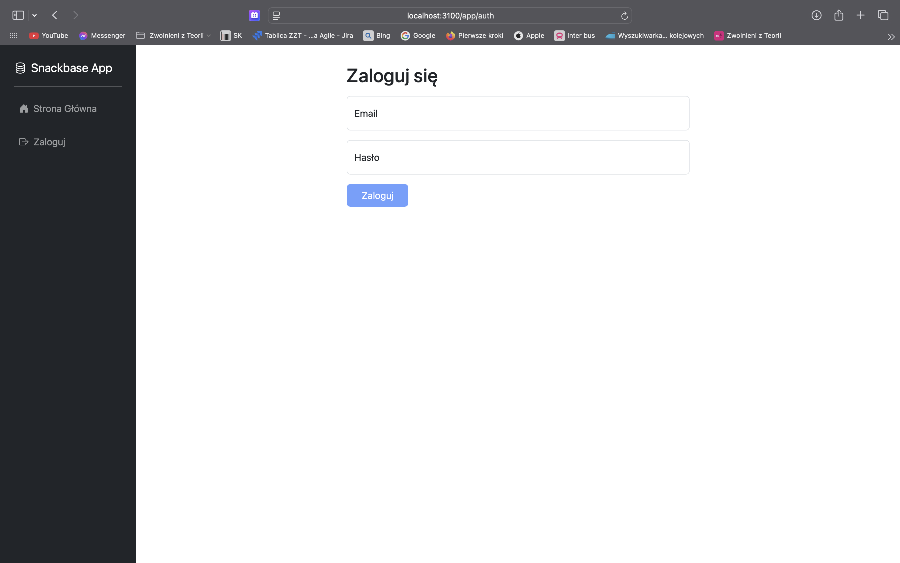

## Navigation and Menu Options

### Overview

The options available in the navigation menu depend on the role assigned to the user. Below is a breakdown of menu items and their accessibility based on roles.

### Menu Structure

- **Warehouse (Magazyn)**
    - View Warehouse (Przeglądaj magazyn)
    - Accept Delivery (Przyjmij dostawę)
    - Load Goods to Machine (Włóż towar do maszyny)
- **Snacks (Przekąski)**
    - View Snacks (Przeglądaj przekąski)
    - Add Snack (Dodaj przekąskę)
- **Machines (Maszyny)**
    - View Machines (Przeglądaj maszyny)
    - Add Machine (Dodaj maszynę)
- **Reports (Raporty)**
    - Create Machine Report (Utwórz raport maszyny/maszyn)
    - Create Warehouse Report (Utwórz raport magazynu)
    - Create Purchase Report (Utwórz raport zakupu)
    - Create Sales Report (Utwórz raport sprzedaży)
- **Users (Użytkownicy)**
    - View Users (Przeglądaj użytkowników)
    - Add User (Dodaj użytkownika)

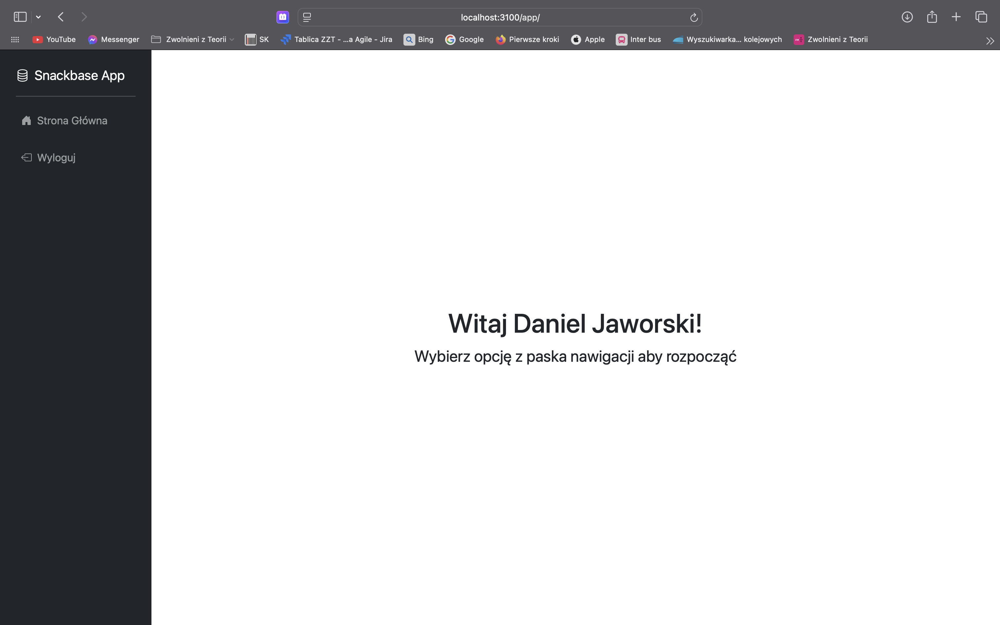

### Role-Based Access

- **Admin** – Access to all sections and options.
- **Office Manager** – Access to Warehouse, Snacks, Machines, Reports, and Users.
- **Logistic Manager** – Access to Warehouse (view, accept delivery, load goods), and Reports.
- **Courier** – Access to Warehouse (load goods to machine).

Upon logging in, the available options dynamically adjust based on the user role, ensuring the interface remains tailored to the responsibilities and permissions of the user.

### Notes

- User accounts are created by the administrator.
- If login credentials are incorrect, the system will display an error message.
- If you forget your password, contact the system administrator to reset it.

## Warehouse Management

### Viewing Warehouse Status

1. **Navigate to the Warehouse Section**
    - In the navigation menu, select **Magazyn** (Warehouse) > **Przeglądaj magazyn** (View Warehouse).
2. **View Inventory**
    - A table displaying the current stock, including snack names, IDs, and quantities, will be shown.

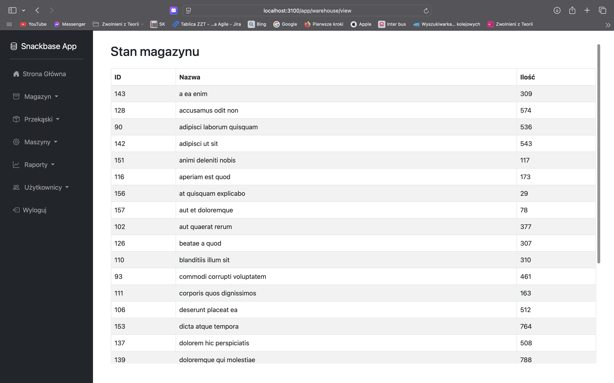

### Accepting Deliveries

1. **Navigate to Accept Delivery**
    - In the navigation menu, select **Magazyn** (Warehouse) > **Przyjmij dostawę** (Accept Delivery).
2. **Select a Snack**
    - A list of snacks will appear. Click **Wybierz** (Select) next to the snack you want to restock.
3. **Confirm Delivery**
    - Enter the quantity of snacks being received.
    - Enter the price from the invoice.
    - Click **Potwierdź** (Confirm) to finalize the delivery.

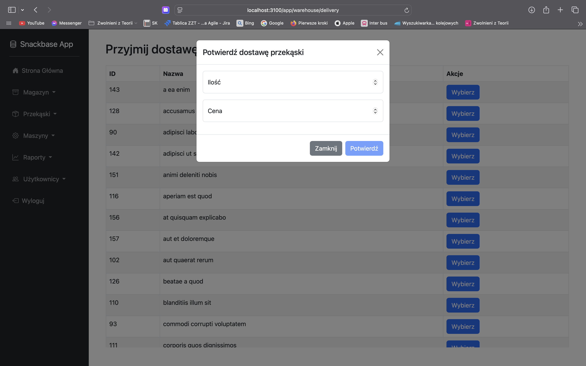

**Note:** Snack inventory is managed by the Office Manager.

## Snack Management

### Viewing and Editing Snacks

1. **Navigate to the Snacks Section**
    - In the navigation menu, select **Przekąski** (Snacks) > **Przeglądaj przekąski** (View Snacks).
2. **View Snack List**
    - A table displaying the list of snacks, including their names and IDs, will appear.
3. **Edit Snack**
    - Click the **Edytuj** (Edit) button next to the snack to modify its name.
    - A popup will appear allowing you to change the snack name.
    - Click **Zapisz** (Save) to confirm changes.

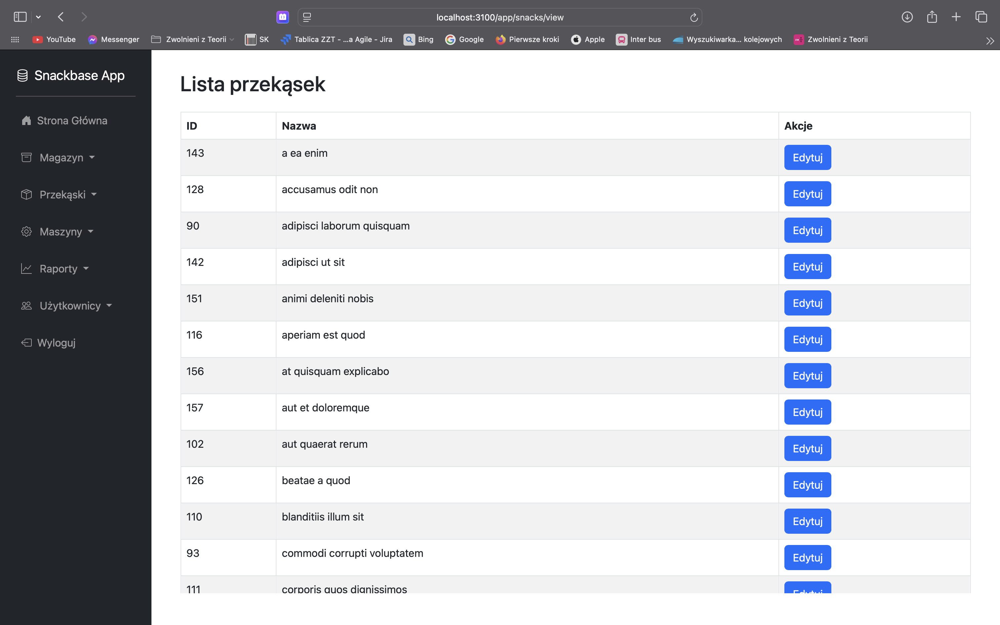
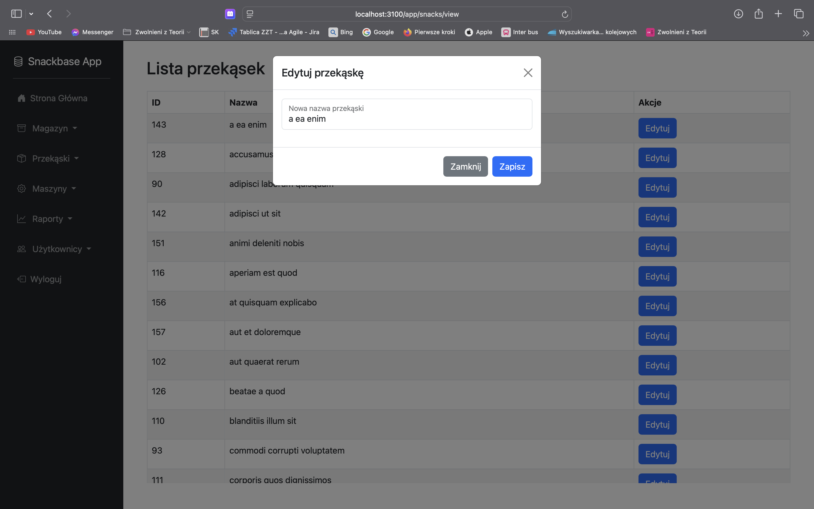

### Adding a New Snack

1. **Navigate to Add Snack**
    - In the navigation menu, select **Przekąski** (Snacks) > **Dodaj przekąskę** (Add Snack).
2. **Enter Snack Details**
    - Fill in the snack name.
3. **Confirm Addition**
    - Click **Dodaj** (Add) to finalize adding the snack.

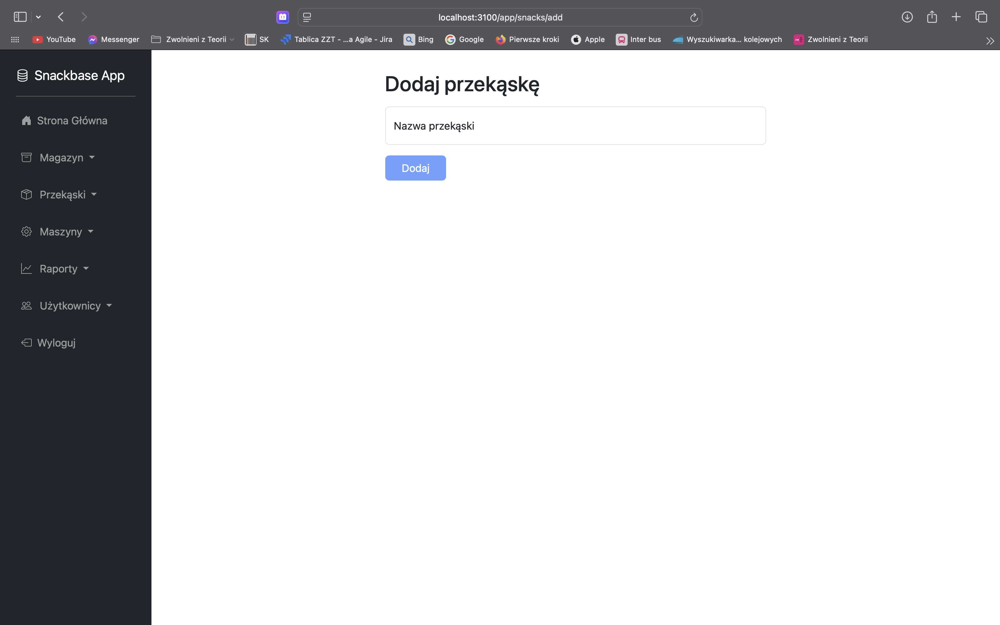

**Note:** Snack management is restricted to Office Managers.

## Machine Management

### Viewing and Editing Machines

1. **Navigate to the Machines Section**
    - In the navigation menu, select **Maszyny** (Machines) > **Przeglądaj maszyny** (View Machines).
2. **View Machine List**
    - A table displaying the list of machines, their locations, number of positions, and capacities will be shown.
3. **Edit Machine**
    - Click the **Edytuj** (Edit) button next to the machine you want to modify.
    - A popup will appear allowing you to edit the location, number of positions, and capacity.
    - Click **Zapisz** (Save) to confirm the changes.

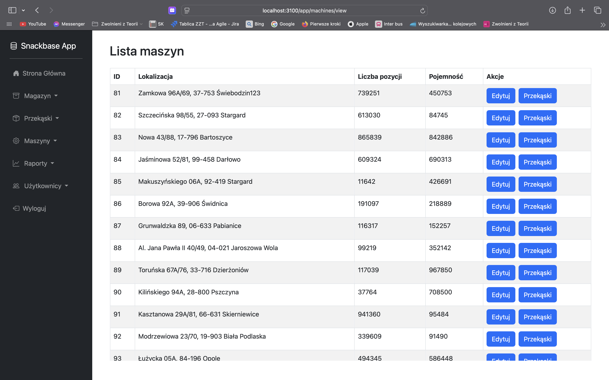
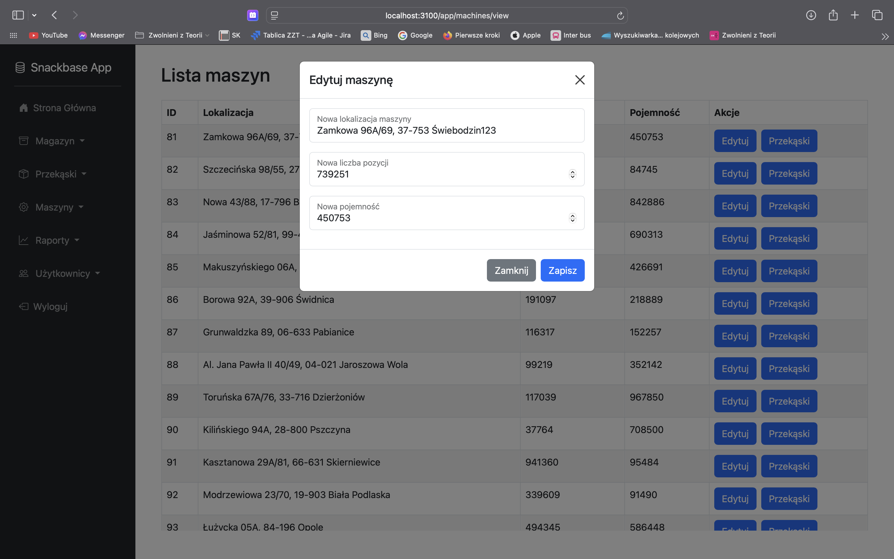

### Adding a New Machine

1. **Navigate to Add Machine**
    - In the navigation menu, select **Maszyny** (Machines) > **Dodaj maszynę** (Add Machine).
2. **Enter Machine Details**
    - Fill in the machine's location, number of positions, and capacity.
3. **Confirm Addition**
    - Click **Dodaj** (Add) to finalize adding the machine.

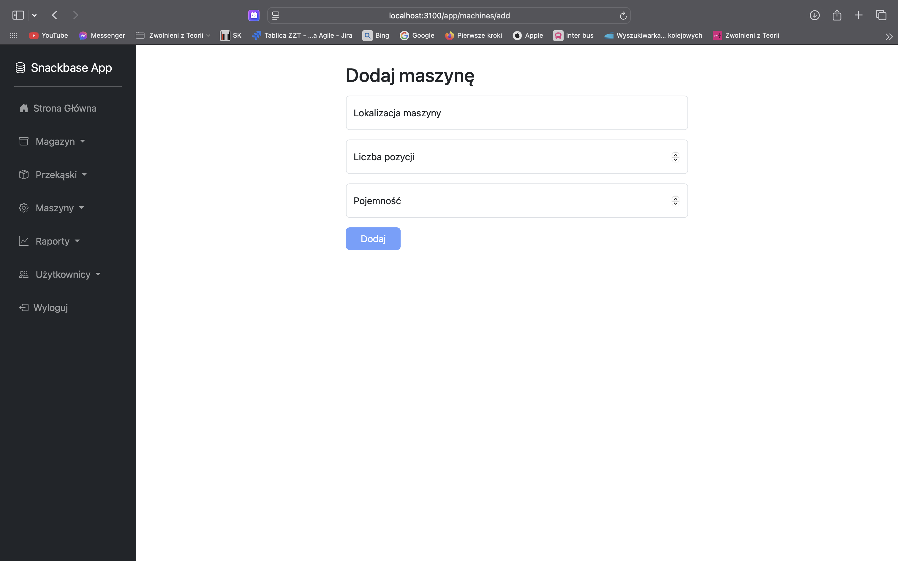

### Managing Snacks in Machines

1. **Select a Machine**
    - From the machine list, click the **Przekąski** (Snacks) button next to the machine you wish to manage.
2. **View Current Snacks**
    - A list of snacks available in the selected machine will appear, showing the snack name, ID, and price.
3. **Edit Snack Price**
    - Click **Zmień** (Change) to modify the price of a snack in the machine.

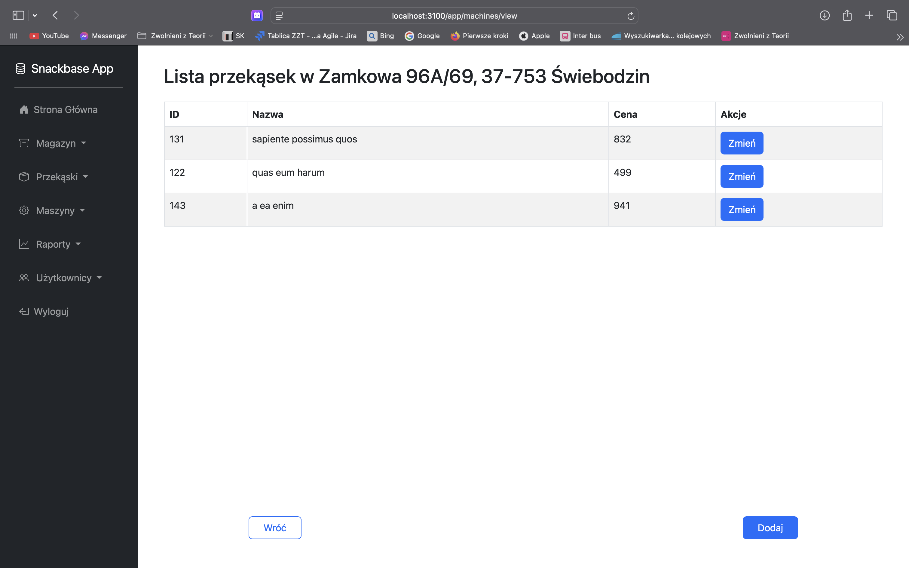

**Note:** Adding the option to sell a snack does not automatically add the snack to the machine. This process establishes pricing for the snack but does not handle inventory transfers.

## Reports

### Overview

The system allows the generation of four types of reports. Each report is created through a guided wizard.

### Types of Reports

1. **Machine Report (Raport maszyny/maszyn)** – Generates data on machine operations.
2. **Warehouse Report (Raport magazynu)** – Provides insights into current warehouse stock.
3. **Purchase Report (Raport zakupu)** – Tracks items purchased for the warehouse.
4. **Sales Report (Raport sprzedaży)** – Displays data on sales transactions from machines.

### Generating Reports

1. **Navigate to Reports**
    - In the navigation menu, select **Raporty** (Reports) and choose the desired report type.
2. **Follow the Wizard**
    - Complete each step of the wizard by selecting relevant parameters (e.g., date ranges, machines, or specific warehouses).
3. **Confirm and Generate**
    - Click **Utwórz** (Create) to finalize and download the report.

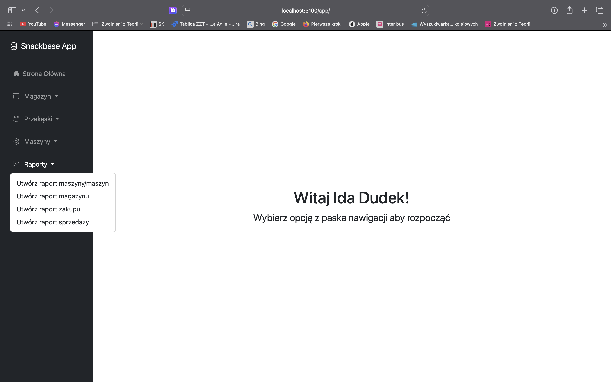

## User Management

### Viewing and Editing Users

1. **Navigate to the Users Section**
    - In the navigation menu, select **Użytkownicy** (Users) > **Przeglądaj użytkowników** (View Users).
2. **View User List**
    - A table displaying the list of users, including their emails, names, and roles, will appear.
3. **Edit User**
    - Click the **Edytuj** (Edit) button next to the user you want to modify.
    - A popup will appear allowing you to change the user's name, roles, email, or password.
    - Click **Zapisz** (Save) to confirm changes.

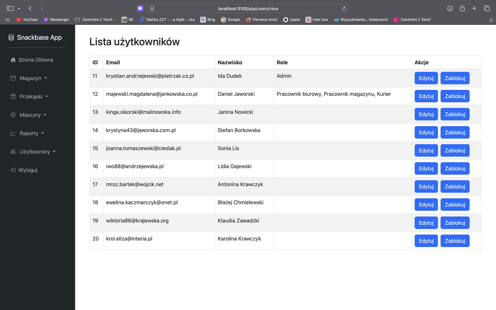
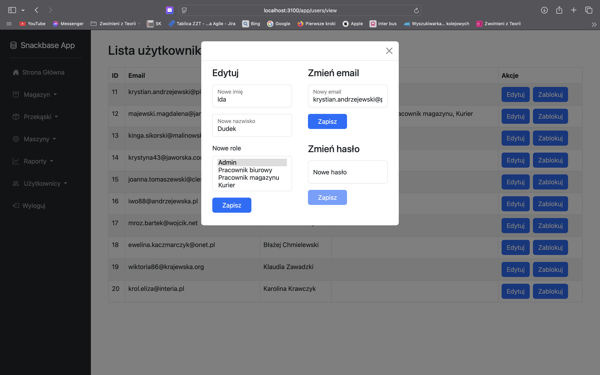

### Disabling a User
Access to app can be restricted if needed by enabling or disabling User.
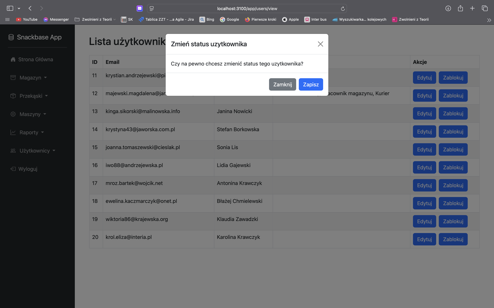

### Adding a New User

1. **Navigate to Add User**
    - In the navigation menu, select **Użytkownicy** (Users) > **Dodaj użytkownika** (Add User).
2. **Enter User Details**
    - Fill in the email, name, and role for the new user.
    - Assign a password.
3. **Confirm Addition**
    - Click **Dodaj** (Add) to finalize adding the user.

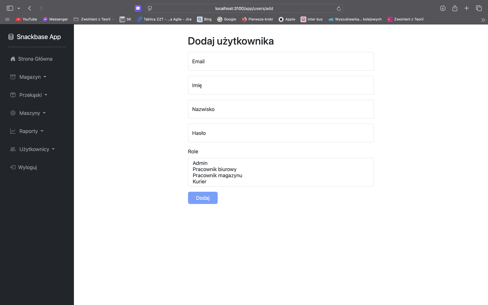

**Note:** Each email can only be registered once in the system.

## Daily report
Additional module for application provide support for sending daily reports to headquarters or management.
By default, reports are being send daily at 9 AM.

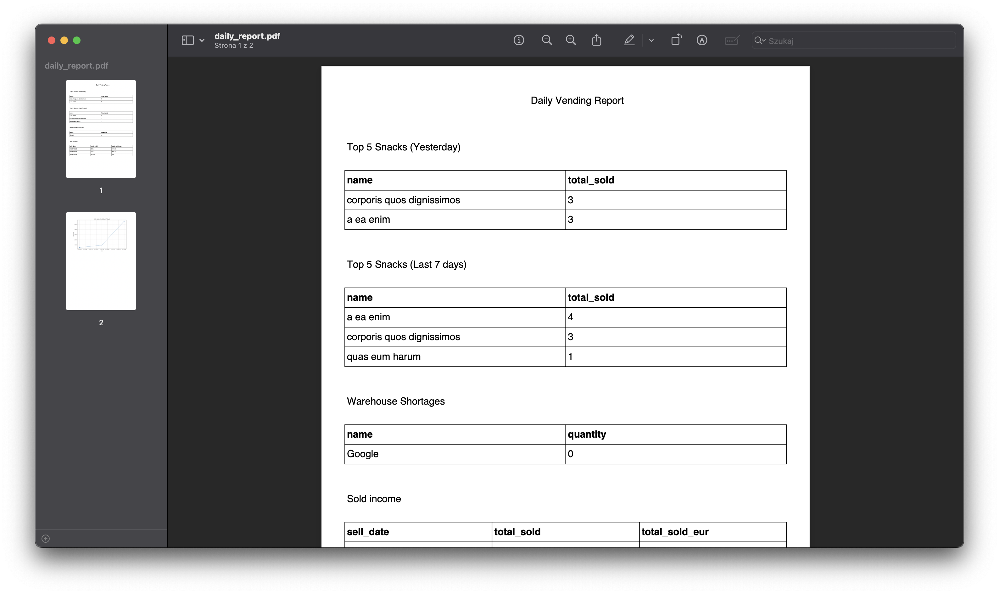

**Note:** Daily reports recipient and sending time may be customized by system administrator.
